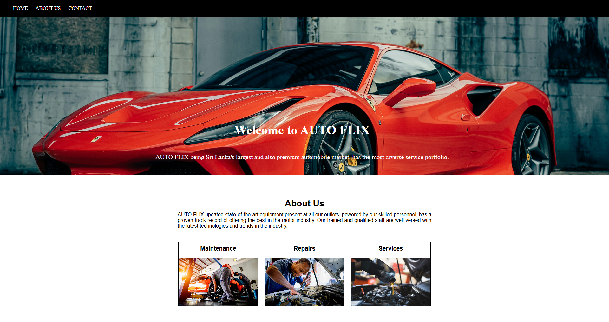

# AUTO FLIX - HTML & CSS Teaching Project

This repository contains the **AUTO FLIX** website design created for teaching HTML and CSS basics.  
It demonstrates how to structure a simple webpage, style it using CSS, and create a clean landing page layout.

---

## 🎯 Purpose
This project was developed **for educational purposes** to teach:
- HTML page structure
- CSS styling and layout
- Navigation bar creation
- Using background images
- Creating a simple "About Us" section with images

---

## 📸 Preview
  
*(Replace `screenshot.png` with your actual screenshot file in the repo)*

---

## 📂 Project Structure
```

auto-flix-html-css-tutorial/
│
├── index.html       # Main HTML file
├── css/
│   └── style.css    # Stylesheet
└── images/          # Image assets (backgrounds, service images)

````

---

## 🛠️ Technologies Used
- HTML5
- CSS3

---

## 🚀 How to View
1. **Clone the repository**
   ```bash
   git clone https://github.com/your-username/auto-flix-html-css-tutorial.git
````

2. **Open the project folder**

   ```bash
   cd auto-flix-html-css-tutorial
   ```
3. **Open `index.html` in your browser**

---

## 🏫 Teaching Notes

This project is designed to be **beginner-friendly** so learners can:

* Understand HTML structure
* Learn how to link CSS
* Practice styling sections
* See how to align text and images
* Learn how to use background images effectively

---

## 📄 License

This project is for **educational purposes** only.
You are free to use, modify, and share it for learning.

```

If you want, I can also create a **sample screenshot.png** for the README so that your GitHub repo has a professional look when viewed. That way, people will instantly see the website design without needing to run it. Would you like me to prepare that?
```
